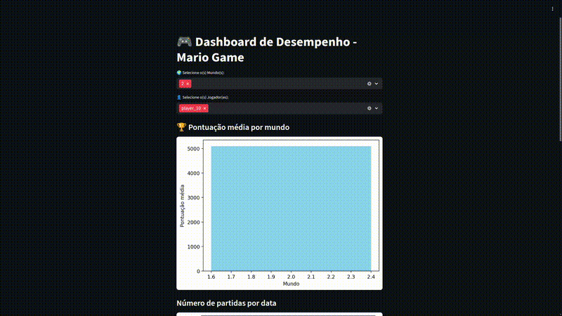

# PySpark + Streamlit Dataflow 

Este projeto demonstra um fluxo completo de análise de dados utilizando **PySpark** para o pré-processamento e **Streamlit** para a visualização interativa.  
A base utilizada é **fictícia**, servindo como treino para aplicações futuras em datasets reais e de maior densidade.

---

## 🧩 Objetivo
Explorar e praticar:
- Manipulação e limpeza de dados com **PySpark**.
- Conversão e integração de dados com **Pandas**.
- Construção de **dashboards interativos** com **Streamlit**.
- Extração de **insights visuais** a partir de dados processados.

---

## ⚙️ Estrutura do Projeto
No projeto irei usar essencialmente o google colab e a partir do drive conseguirei salvar os arquivos de analise.

## Tecnologias utilizadas
- PySpark
- Pandas
- Stramlit
- Matplotlib

## Funcionamento

  

